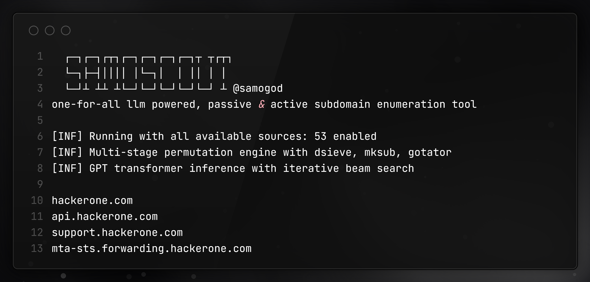

<h1 align="center">
  
  <br>
</h1>

<p align="center">
<a href="https://opensource.org/licenses/MIT"></a>
<a href="https://github.com/samogod/samoscout/issues"></a>
<a href="https://goreportcard.com/badge/github.com/samogod/samoscout"></a>
<a href="https://github.com/samogod/samoscout/releases"></a>
<a href="https://golang.org/"></a>
<a href="https://github.com/samogod/samoscout/stargazers"></a>
</p>

<p align="center">
  <a href="#features">Features</a> •
  <a href="#install">Build</a> •
  <a href="#usage">Usage</a> •
  <a href="#configuration-reference">Config</a> •
  <a href="#running-samoscout">Running samoscout</a> •
  <a href="#technical-implementation">Implementation</a> •
</p>

---

**samoscout** is an orchestrated subdomain discovery pipeline implementing passive reconnaissance, active enumeration, deep-level permutation, and neural network-based prediction. Native Go implementation with zero external binary dependencies for passive sources.



## Features

**Core Engine**
- Multi-phase workflow orchestrator with concurrent execution
- YAML configuration system with runtime reload capability
- HTTP client pool with connection reuse and retry mechanisms
- PostgreSQL database for subdomain tracking

**Passive Reconnaissance**
- 53 native API integrations without external binary dependencies
- Concurrent source execution with configurable timeouts
- Result deduplication and validation pipeline
- Source-specific rate limiting and error handling

**Active Enumeration**
- Wordlist-based subdomain generation and permutation
- Multi-level dsieve algorithm with Trickest wordlists
- DNS resolution via puredns with wildcard detection
- Rate-limited query execution with trusted resolver pools

**Machine Learning Prediction**
- PyTorch transformer model for subdomain prediction
- Iterative refinement with validated result feedback
- Configurable generation parameters and recursion depth
- Cross-platform inference via stdin/stdout IPC

**Passive Sources**
AlienVault, Anubis, BeVigil, BufferOver, BuiltWith, C99, CeBaidu, Censys, 
CertSpotter, Chaos, Chinaz, Cloudflare, CommonCrawl, crt.sh, DigiCert, 
DigitalYama, DigiTorus, DNSDB, DNSDumpster, DNSGrep, DNSRepo, DriftNet, 
FOFA, FullHunt, GitLab, HackerTarget, HudsonRock, Hunter, JSMon, MySSL, 
Netcraft, Netlas, PugRecon, Quake, RapidDNS, ReconCloud, RedHuntLabs, 
Robtex, RSECloud, SecurityTrails, Shodan, ShrewdEye, SiteDossier, 
SubdomainCenter, ThreatBook, ThreatCrowd, ThreatMiner, URLScan, VirusTotal, 
WaybackArchive, WhoisXMLAPI, WindVane, ZoomEye


## Technical Implementation

### DNS Resolution Integration

**puredns Configuration**
- Resolver sources: Trickest community + trusted, public-dns.info
- Resolver count: ~73,000 aggregated resolvers
- Trusted resolvers: 31 high-reliability servers
- Rate limiting: 100 queries/sec (normal), 100 queries/sec (trusted)
- Wildcard detection: 30 tests, 1M batch size
- Resolution modes: resolve (standard), bruteforce (wordlist-based)

### LLM Inference Architecture

**Model Specifications**
- Architecture: GPT transformer
- Source: HuggingFace HadrianSecurity/subwiz
- Context window: 1024 tokens
- Tokenization: Comma-separated subdomain list + [DELIM] token
- Decoding: Beam search with top-N sampling
- Temperature: Configurable (default: 0.0 for deterministic output)


**Iterative Refinement**
```
Iteration 1: Seed with passive results → predictions → validate
Iteration 2: Seed with (passive + validated) → predictions → validate
...
Iteration N: Continue until max_recursion or no new results
```

## Install

### Quick Install
```bash
go install github.com/samogod/samoscout@latest
```

### From Source
```bash
git clone https://github.com/samogod/samoscout.git
cd samoscout
go mod download
go build -o samoscout main.go
```


### Deep Enumeration Workflow


## Usage

```
samoscout -h
```

This will display help for the tool. Here are all the switches it supports.

```
Usage:
  samoscout [flags]
  samoscout [command]

Available Commands:
  track       Query subdomain tracking database
  update      Update samoscout to the latest version
  version     Show version information
  help        Help about any command

Flags:
INPUT:
   -d, -domain string      target domain to enumerate
   -dL, -list string       file containing list of domains to enumerate

SOURCE:
   -s, -sources string     comma-separated list of sources to use (e.g., 'subdomaincenter,shrewdeye')
   -es string              comma-separated list of sources to exclude (e.g., 'alienvault,zoomeyeapi')

ACTIVE ENUMERATION:
   -active                 enable active subdomain enumeration (wordlist + dsieve + mksub)
   -deep-enum             enable deep level enumeration (dsieve + trickest wordlists)

AI PREDICTION:
   -llm                    enable AI-powered subdomain prediction

HTTP PROBING:
   -httpx                  enable HTTP/HTTPS probing on discovered subdomains

OUTPUT:
   -o, -output string      file to write output to
   -j, -json               write output in JSONL(ines) format
   -silent                 silent mode - no banner or extra output
   -stats                  display source statistics after scan

CONFIGURATION:
   -c, -config string      config file path (default: config/config.yaml)

OPTIMIZATION:
   -v, -verbose            enable verbose/debug output
```

## Running Samoscout

### Basic Operations
```bash
# Single domain enumeration
samoscout -d example.com

# Multiple domains from file
samoscout -dL domains.txt

# Source selection
samoscout -d example.com -s alienvault,crtsh,virustotal

# Source exclusion
samoscout -d example.com --es alienvault,anubis

# Output formats
samoscout -d example.com -o output.txt
samoscout -d example.com -j > output.json

# Statistics display
samoscout -d example.com --stats
```

### Advanced Enumeration
```bash
# Active enumeration (wordlist + dsieve + mksub + gotator)
samoscout -d example.com --active

# Deep enumeration (multi-level dsieve + trickest wordlists)
samoscout -d example.com --active --deep-enum

# LLM-powered prediction
samoscout -d example.com --llm

# HTTP probing
samoscout -d example.com --httpx

# Combined full enumeration
samoscout -d example.com --active --deep-enum --llm --httpx --stats
```

### Database Operations
```bash
# Query tracked subdomains
samoscout track example.com

# Filter by status
samoscout track example.com --status new
samoscout track example.com --status dead
samoscout track example.com --status active

# List all tracked domains
samoscout track --all
```

### System Operations
```bash
# Display version information
samoscout version

# Update to latest release
samoscout update
samoscout update -v
```

## Configuration Reference

Configure API keys and runtime settings in the config file located at `$HOME/.config/samoscout/config.yaml`.

### API Keys Configuration
```yaml
api_keys:
  virustotal: ""
  chaos: ""
  censys: ""
  securitytrails: ""
  shodan: ""
```

### Runtime Configuration
```yaml
default_settings:
  timeout: 10                        # Global timeout in minutes

active_enumeration:
  enabled: false                     # Enable active enumeration
  dsieve_top: 50                     # Top N domains for dsieve
  dsieve_factor: 4                   # Permutation depth
  output_dir: ".samoscout_active"    # Workspace directory

llm_enumeration:
  enabled: false                     # Enable transformer prediction
  device: "cpu"                      # PyTorch device (cpu/cuda)
  num_predictions: 500               # Predictions per iteration
  max_recursion: 5                   # Maximum iteration depth
  max_tokens: 10                     # Token generation limit
  temperature: 0.0                   # Sampling temperature
  run_after_passive: true            # Execute after passive phase
  run_after_active: false            # Execute after active phase

database:
  enabled: false                     # Enable subdomain tracking
  host: "localhost"                  # PostgreSQL host
  port: 5432                         # PostgreSQL port
  user: "postgres"                   # Database user
  password: "postgres"               # Database password
```

## Database Schema

### Table Definitions
```sql
CREATE TABLE subdomains (
    id INTEGER PRIMARY KEY AUTOINCREMENT,
    domain TEXT NOT NULL,
    subdomain TEXT NOT NULL,
    status TEXT NOT NULL CHECK(status IN ('ACTIVE', 'DEAD', 'NEW')),
    first_seen DATETIME NOT NULL,
    last_seen DATETIME NOT NULL,
    UNIQUE(domain, subdomain)
);

CREATE INDEX idx_domain ON subdomains(domain);
CREATE INDEX idx_status ON subdomains(status);
CREATE INDEX idx_subdomain ON subdomains(subdomain);
CREATE INDEX idx_last_seen ON subdomains(last_seen);
```

### Status Computation Logic
```
NEW:    First discovery (subdomain not in database)
ACTIVE: Present in current scan AND previous scan
DEAD:   Present in previous scan, absent in current scan
```

### Query Examples
```sql
-- Find new subdomains for domain
SELECT subdomain FROM subdomains 
WHERE domain = 'example.com' AND status = 'NEW'
ORDER BY first_seen DESC;

-- Find dead subdomains in last 7 days
SELECT subdomain, last_seen FROM subdomains
WHERE domain = 'example.com' AND status = 'DEAD'
AND last_seen > datetime('now', '-7 days')
ORDER BY last_seen DESC;

-- Subdomain statistics per domain
SELECT domain, 
       COUNT(*) as total,
       SUM(CASE WHEN status = 'ACTIVE' THEN 1 ELSE 0 END) as active,
       SUM(CASE WHEN status = 'DEAD' THEN 1 ELSE 0 END) as dead,
       SUM(CASE WHEN status = 'NEW' THEN 1 ELSE 0 END) as new
FROM subdomains
GROUP BY domain;
```

## Update System

```bash
# Check and install latest version
samoscout update
```
## Performance Characteristics

### Throughput Metrics
- Passive sources: 53 concurrent API requests
- DNS resolution: ~1000-5000 queries/second (puredns)
- Active candidates: Limited to 25K with random sampling
- LLM inference: ~10-50 predictions/second (CPU), ~100-200 (GPU)

### Memory Footprint
- Base: ~50-100 MB
- Per-source overhead: ~1-5 MB
- Active enumeration: ~100-500 MB (wordlist processing)
- LLM model: ~50-100 MB (transformer weights)

## Source Interface Implementation

### Interface Definition
```go
type Source interface {
    Run(ctx context.Context, domain string, s *Session) <-chan Result
    Name() string
}

type Result struct {
    Type   string  // "subdomain", "error"
    Value  string  // subdomain or error message
    Source string  // source name
    Error  error   // error object if applicable
}
```

### Implementation Example
```go
func (s *ExampleSource) Run(ctx context.Context, domain string, sess *session.Session) <-chan Result {
    results := make(chan Result)
    
    go func() {
        defer close(results)
        
        // API request
        resp, err := sess.Client.Get(apiURL)
        if err != nil {
            results <- Result{Source: s.Name(), Error: err}
            return
        }
        defer resp.Body.Close()
        
        // Parse response
        var data ResponseType
        json.NewDecoder(resp.Body).Decode(&data)
        
        // Stream results
        for _, subdomain := range data.Subdomains {
            select {
            case results <- Result{
                Source: s.Name(),
                Value:  subdomain,
                Type:   "subdomain",
            }:
            case <-ctx.Done():
                return
            }
        }
    }()
    
    return results
}
```

## License and Attribution

### Third-Party Integrations
- Dsieve permutation logic inspired by trickest/dsieve (MIT License)
- Mksub combination algorithm from trickest/mksub (MIT License)
- LLM model: HadrianSecurity/subwiz (HuggingFace)
